# 🍽️ Restaurante Chedy's

Sistema web completo con frontend en React y backend en Spring Boot + Oracle. Gestiona meseros, alimentos, mesas y pedidos de forma visual y eficiente.

## 📦 Tecnologías utilizadas

- **Frontend:** React + Vite + Tailwind CSS
- **Backend:** Spring Boot + JPA + Oracle 19c
- **Base de datos:** Oracle SQL
- **Control de versiones:** Git + GitHub
- **Correo:** SMTP Gmail para recuperación de contraseñas
- **Pruebas:** Postman

## 🎯 Funcionalidades

- Login seguro para meseros y gerentes
- Vista de gerente con administración de personal y alimentos
- Vista de meseros con gestión de pedidos por mesa
- Vista por mesa con cambio de estado (libre, ocupado, reservado)
- Generación de pedidos (comida, bebida, postre)
- Edición y finalización de pedidos
- Envío de credenciales por correo electrónico

## 🖼️ Capturas de pantalla

### 🟠 Login y recuperación
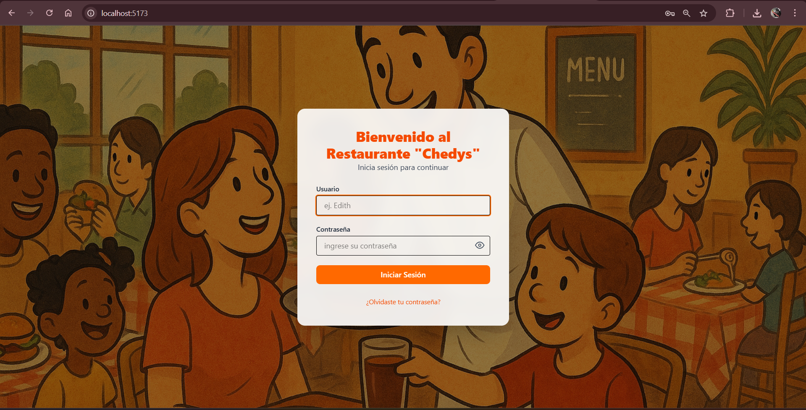
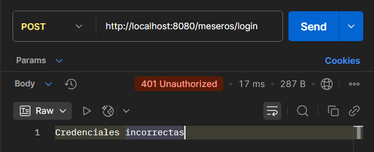

### 👩‍🍳 Vista Gerente
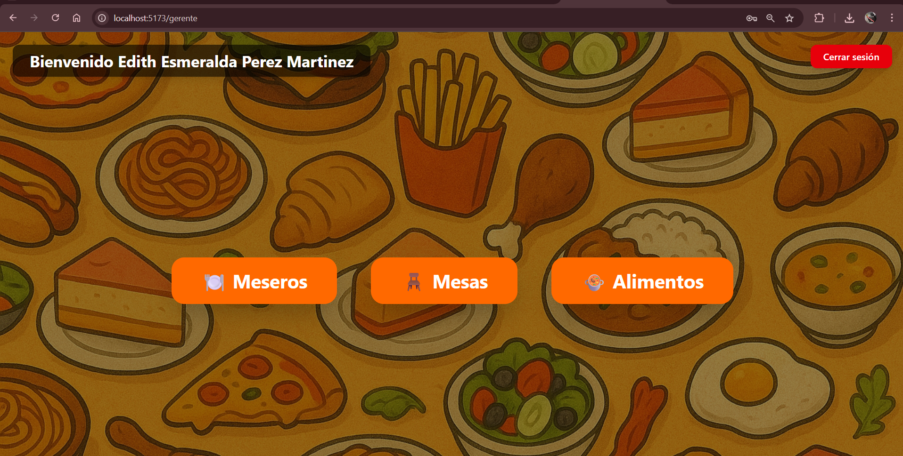
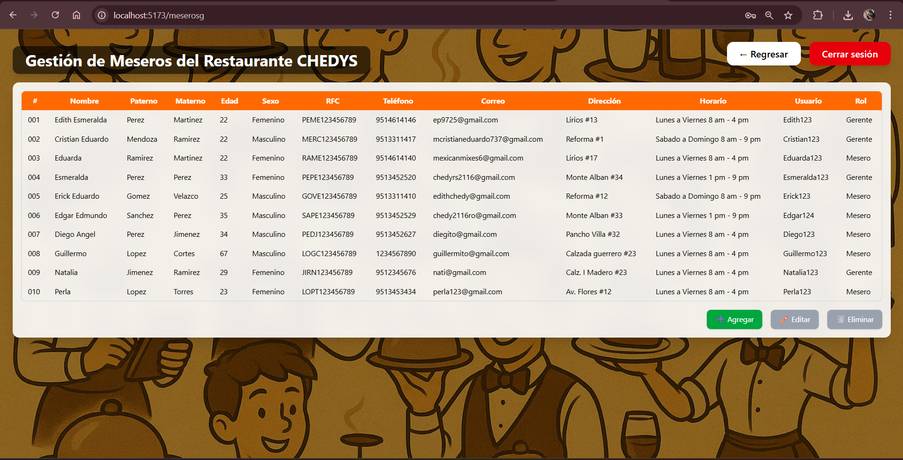
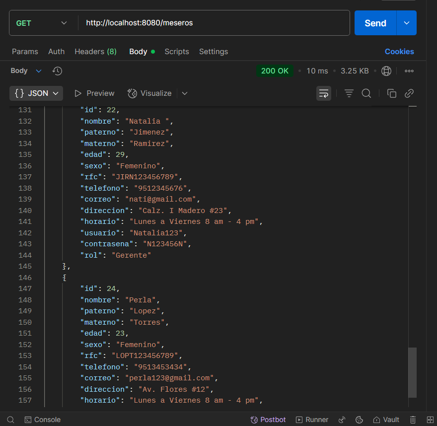

### 🧑‍🍽️ Vista Meseros
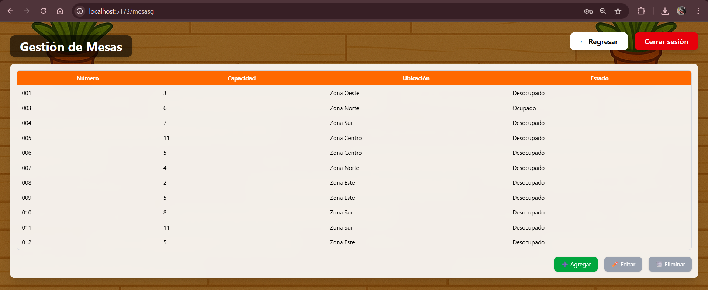
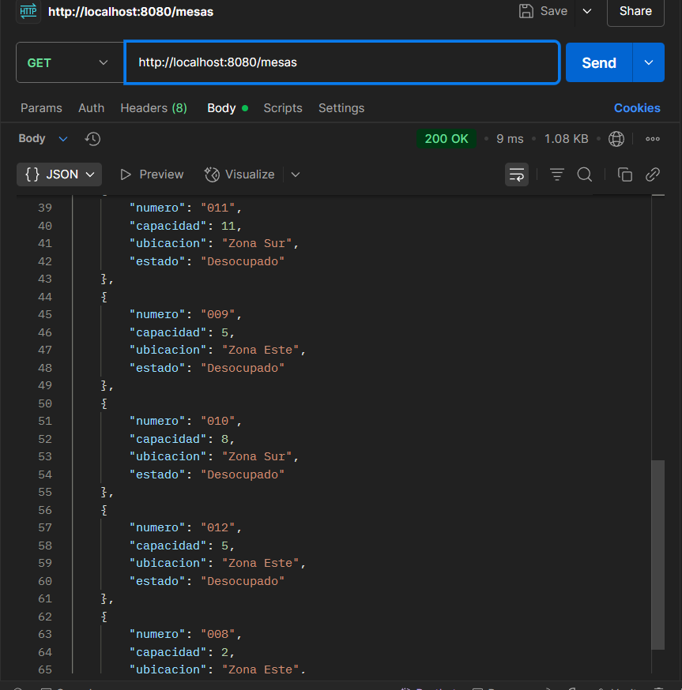
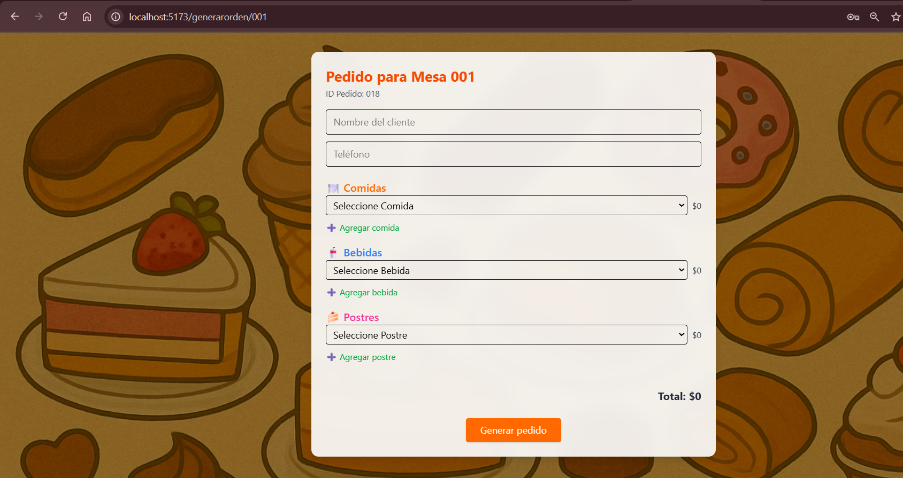

### 🧾 Pedidos
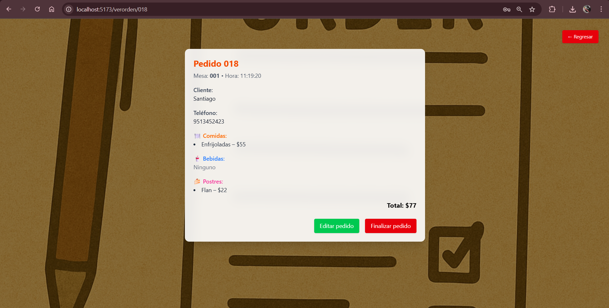
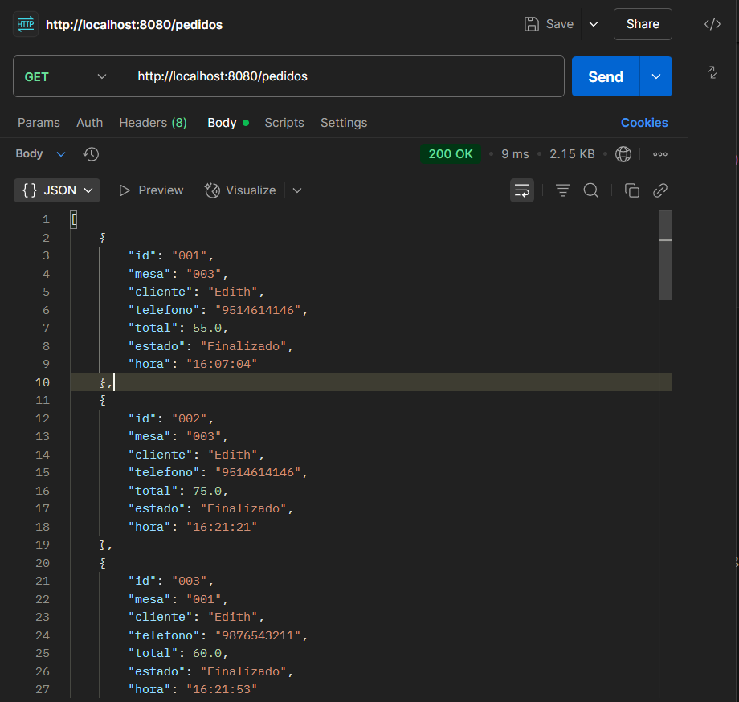

### 🔧 Backend

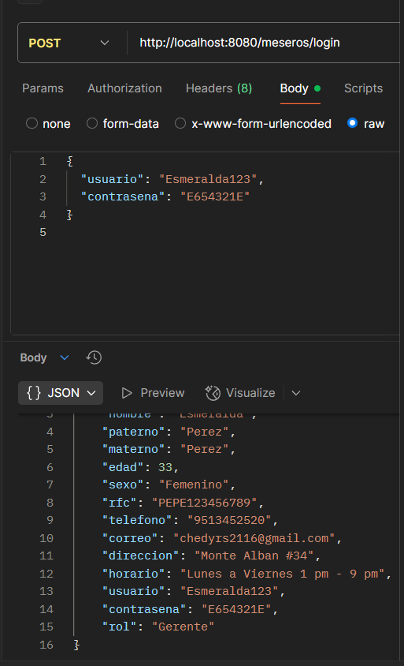

## ⚙️ Estructura del proyecto

